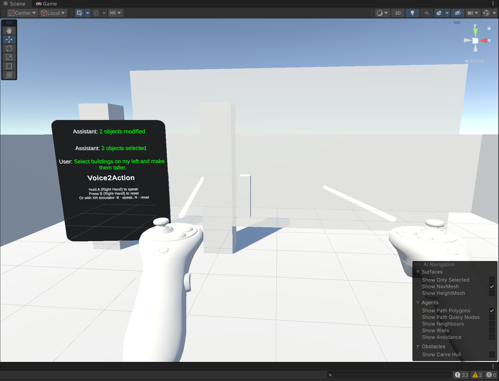
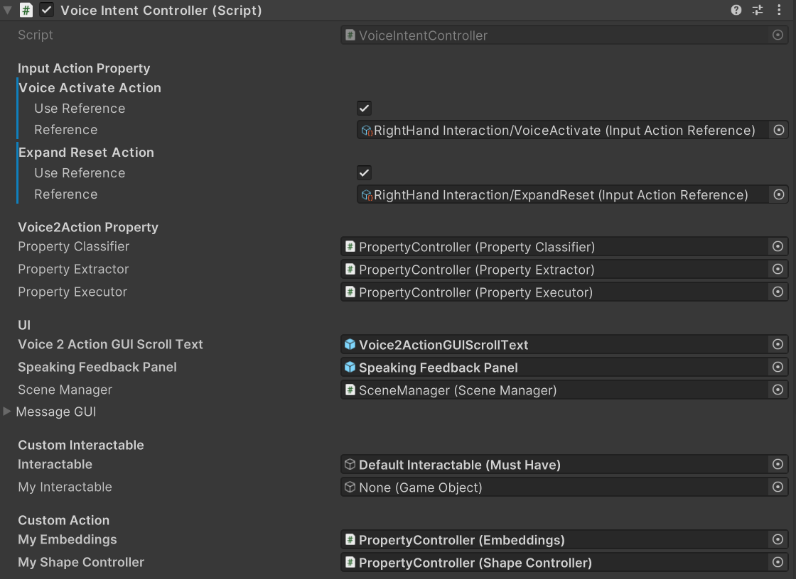
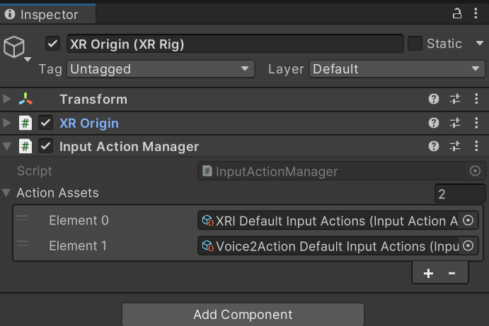
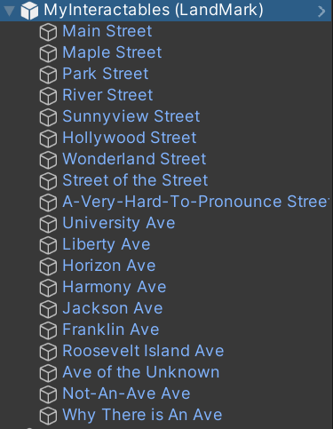
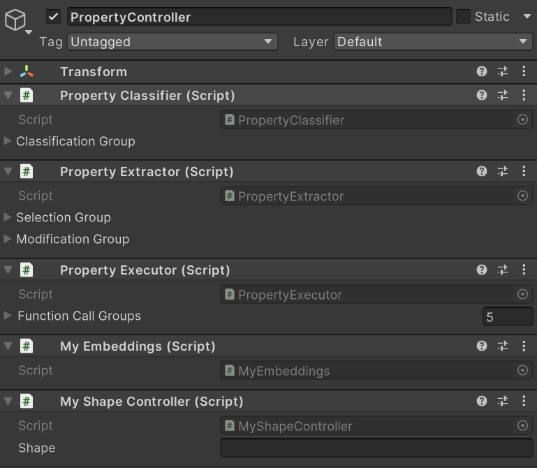
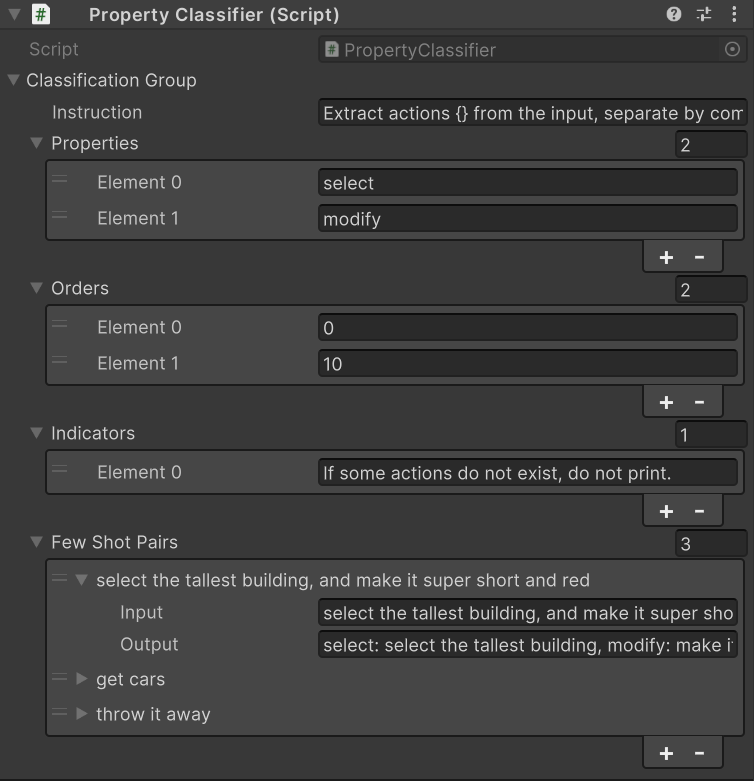
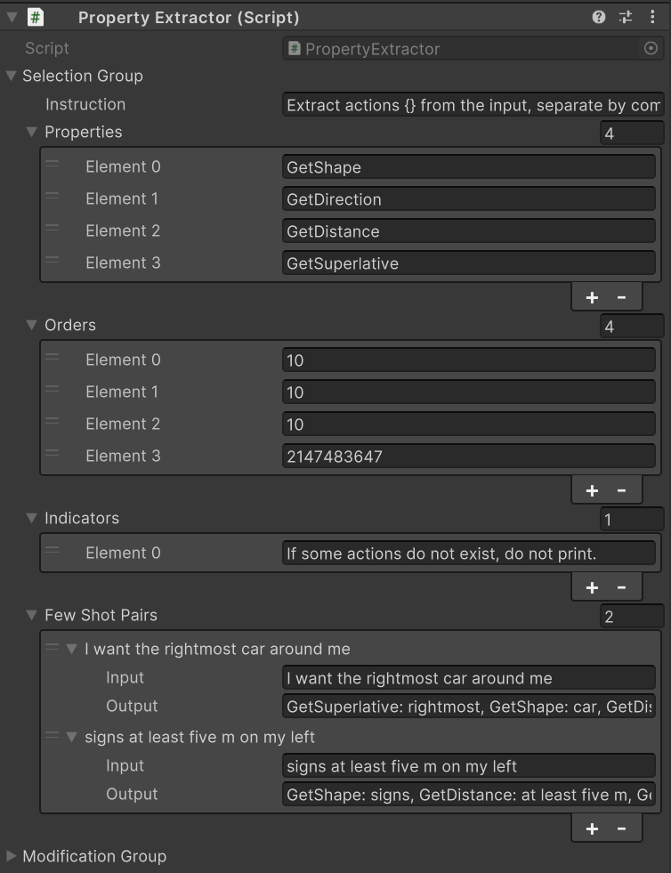
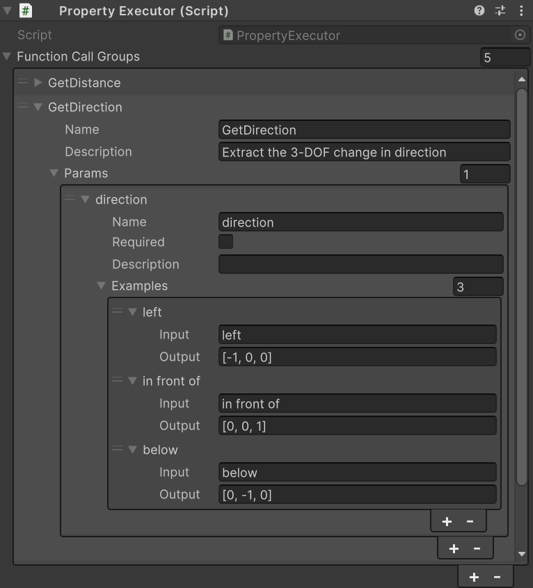

# Voice2Action - VR Multimodal Interaction with LLM Agents

This project was done by students at the [XR Collaboratory](https://xr.cornell.edu/collaboratory) at Cornell Tech.

### Overview

This package uses LLMs (Large Language Models) to analyze user instruction through action and entity extraction, and divides the execution tasks into canonical interaction subsets with error prevention from the game engine feedback. It combines an "Expand" interaction technique to create an innovative selection and manipulation mechanism for enhanced user experiences. 

By incorporating this package into your VR project, you can use voice commands to filter through multiple objects, create smaller, scaled-down versions of the original object called "proxy objects", and bring the proxy objects into view. When you hover over the proxy object, it will show the user the information of the original object. A raycast will also show the user where the object is located. Users are then able to modify the properties of the filtered objects through customizable voice commands.

For the original repository of the package, go to [Voice2Action GitHub Repository (Paper & Package)](https://github.com/yang-su2000/Voice2Action)

### Requirements

- Unity Version 2022.03
- [OpenAI UPM](https://openupm.com/packages/com.openai.unity/) Version 7.3.2
  - Must have OpenAI credentials: API Key and Organization ID

### Package contents

**Overview**

The user input would be sent to a parallelizable series of classes for LLMs to analyze and execute user-defined functions on given interactable targets (game objects) through functional impact analysis and reflection. User can customize the property manipulation categories of game objects by inheriting "ShapeController.cs" and customize their usage by inheriting "Embeddings.cs". See "Samples/CityDemo/Scripts/" and the Advanced section below for more details.

**Runtime**

The runtime folder contains the core scripts of this package. There are 2 prefabs that the user wants to put into the scene to use Voice2Action customizably.
- The **Voice2Action** Prefab.
    - This prefab contains the core system of Voice2Action. User can put it anywhere they want.
- The **Voice2ActionGUI** Prefab.
    - This prefab is for interaction. The user wants to put this prefab to somewhere comfortable, e.g. attach it to the left/right hand controller, as what we do in "Samples".

**Samples**

- "Starter Assets"
    - Contains essential prefabs and tutorial scenes of the Voice2Action system
    - Contains two scenes "StarterScene-Empty" and "StarterScene-Complete"
    - User can use these scenes to become familiar with the system, see the Tutorial section below for more information
- "CityDemo"
    - Contains a scene "CityScene" with customized actions and properties
    - User can use this scene for a thorough playthrough of the capabilities and limitations of the system, preparing them for Advanced usage of the system
    - "CityScene" uses an urban planning environment to call different buildings, cars, trees, etc. in different directions / locations / streets, and user can modify the colors, sizes, positions of selected objects
  
### Installation instructions

This package requires a 2-step installation process. 

**Prerequisites (Open AI UPM and XR Interaction Tookit)**

1. Navigate to this page and follow the instructions to install the Open AI UPM package: [https://openupm.com/packages/com.openai.unity/](https://openupm.com/packages/com.openai.unity/)
   - Go to **Windows > Package Manager > My Registries > OpenAI > Version History** to check the OpenAI UPM version is **7.3.2**. If not, update the version
   - (Optional but recommended) Restart your project as OpenAI UPM sometimes has configurations that are only updated after restarting Unity
2. In the Assets folder, create a folder titled "**Resources**". 
3. Inside the folder, right click and select **Create > OpenAI > OpenAIConfigurations**. 
4. Enter your *API key* and *organization ID* from the OpenAI API user settings. Other fields can be left blank.
5. Go to **Windows > Package Manager**, install XR Interaction Toolkit Package.
    - In the Samples tab, import "Starter Assets" and "Device Simulator"

**Voice2Action Package** 

1. In the Package Manager, click the "+" button on the left-hand corner. Select "Add package through git URL." 
2. Add the package link [https://github.com/yang-su2000/Voice2Action.git](https://github.com/yang-su2000/Voice2Action.git) into the URL field.
    - In the Samples tab, import "Starter Assets"
    - (Optional) In the Samples tab, you can import **CityDemo** to see a sample scene of the usage of our package

### Get Started

- Open "Samples/Starter Assets/StarterScene-Complete" and hit play, make sure there are exactly **10** debug logs - which denotes successful installation.
    - Toggle right controller, **Hold** B and say "Select buildings on my left and make them taller"
        - Make sure you have microphone on! If you see the system output "you", it is mostly because that the microphone is not detected.
    - You should see those buildings get filtered and show on the Expand Panel as follows and become taller, if yes, you are good to go!

### Tutorial

- [Step-by-Step Tutorial Video](https://drive.google.com/file/d/1v57kEXheWsnz9mDRum2bTXlCHYDKECTG/view?usp=sharing)
- (1) In "Stater Assets", you'll find "StarterScene-Empty" and "StarterScene-Complete"
    - Follow the following steps to upgrade "StarterScene-Empty" to the "StarterScene-Complete" version
    - You can use "StarterScene-Complete" as a reference to ensure correct completion of the tutorial
- (2) Place the following prefabs into the Unity Hierarchy.
    - Place **Voice2Action** anywhere
    - Place **Voice2ActionGUI** as a child of **XR Origin (XR Rig) > Camera Offset > Left Controller** (tips: this is for convenience, you can put it anywhere)
- (3) Create an empty parent gameobject to hold all interactables, name it "Default Interactable" (tips: this is for convenience, you can name it anything).
    - Create sub-parent gameobjects and name them the object types that their children will have
    - For example, if your have some "Buildings" gameobjects, put them under here - the system will recognize their object types by this name.
    - Let's put some primary cubes as children gameobjects to "Buildings", name them anything
    - The following should be your current Hierarchy (except possible difference under "Default Interactable")

- (4) Click on **Voice2Action > SceneManager** to open its inspector.
    - Attach "Left/Right Ray Interactor" to its corresponding gameobject
    - Attach "XR Origin Camera" to its corresponding gameobject
    - You want to get the following setup

- (5) Click on **VoiceIntentController** to open its inspector.
    - Attach "Voice2ActionGUIScrollText" to its corresponding gameobject
    - Attach "SpeakingFeedbackPanel" to its corresponding gameobject
    - Attach "Interactable" to the parent gameobject we created in step (3)
    - "MyInteractable" can be left empty, see Advanced section below for its usage
    - You want to get the following setup

- (6) Lastly, for the UI to take effect
    - On **XR Origin (XR Rig)**, attach the "InputActionManager" preset to the component 
    - You want to get the following setup

- Now you should be good to use the system - hit play and make sure the result matches exactly to that of the "Get Started" section

**Custom Scene**

- To create a custom scene, follow steps 2-5 in the tutorial. 
  - The Voice2Action system filters objects by making the unmatched objects transparent, so if your object's material is non-transparent, they might still show (visually), but not on the Expand Panel

### Advanced - UI Customization

**Interactables**

By default, all interactable objects are grouped under a parent game object. This enables the system to specify different groups of objects types by their names, the following image shows the example in "Samples/CityDemo".

**My Interactables**

User can customizably define how they wish to detect objects as well. For example, in "Samples/CityDemo", we use *MyInteractables* as entry for detecting landmarks, which is used to call objects located in a specific area. The is very flexible as user can override all behaviors of this gameobject by simply attaching it to the serialize field of *VoiceIntentController*. For example, we can use tags, materials, positions to detect objects, just to name a few.

**Expand Panel**

The Expand Panel is used to store the objects you've called that will be "expanded" in front of you. When you highlight over an object that is presented to you in the expand panel, it will show a raycast indicating the location of the object as well as general information of the object.

### Advanced - LLMs Customization

- The user can customizably define their own classes and functions for broader interaction categories.
- You want to write code that follows the instructions **exactly** as specified as follows - reflection is used for the system to perform its core functionality, and it would be quite hard to debug (although we provide extensive error prevention) if you did them wrong.
- You can open "Samples/CityDemo" and play around with it to better understand the system.
    - Make sure to follow step (6) in the tutorial for the UI to take effect

### Custom Actions

- Go to **Voice2Action > PropertyController (Game Object)**. 
    - Write atomic functions by inheriting "Embeddings.cs" and "ShapeController.cs" classes
    - Example usage can be found in "Samples/CityDemo/Scripts/MyEmbeddings.cs" and "Samples/CityDemo/Scripts/MyShapeController.cs"
- Attach this customized "PropertyController" to **Voice2Action > VoiceIntentController (Game Object) > VoiceIntentController (Scripts) > CustomAction** to take effect.
- When the scene starts, "MyShapeController" field will become *None* (on purpose), which indicates success.

**Example: LandMark**

In order to call an object near certain street, we want to specify where the boundaries that street is by writing atomic functions that define "boundaries".
- "MyEmbeddings.cs" is used to initialize where the landmarks are and store them in a publicly available data structure (like a dictionary, for example)
- "MyShapeController.cs: is used to write functions that specify what it means by "object is within current landmark's boundary"
- Now, when the user calls for objects near Main Street, it will call all the objects that are near the strip of land shown below

### Custom Properties

In order for the LLMs to perform accruate actions, the user can choose to add few-shot examples to demonstrate how to call each action, including but not limited to class/function/atomic action description, constraints, execution orders and confidence thresholds.

**Property Classifier**

An example customization of the "LLM for Classification" step implemented in "Samples/CityDemo", e.g. does user instruction contains selection or modification?
- *Instruction* must contain "{}" for property insertion. 
- Lower *orders* indicate higher priorities. 
- *Indicators* are used to specify constraints or remarks of the properties.

User can either declare properties in the Unity hierarchy directly, or do so with code by overriding "Embeddings.Init(My)Interactables(...)", see "Samples/CityDemo/Scripts/MyEmbeddings.cs" for more details.

**Property Extractor**

An example customization of the "LLM for Extraction" step implemented in "Samples/CityDemo". The hierarchy follows "LLM for Classification".

**Propety Executor**

An example customization of the "LLM for Execution" step implemented in "Samples/CityDemo". This is not required but will likely improve execution success rate.

- *params* are used to declare parameter types and their example usages.

### Advantages

- Efficiency: Extremely **Low Cost**
  - Based on our testing in the "Samples/CityDemo" with 2 ** (7+3) = 1024 function call combinations (with infinite argument combinations) and 100 * 32 = 3.2k user interaction (including multi-turn due to execution failure), our OpenAI API (with gpt-3.5-turbo) total cost ~= 5 USD, which converts to 0.16 cents per interaction!
- Domain Adaptation: Highly **Customizable**
  - User can customize their actions and properties by easily inheriting our Runtime scripts, see examples in the Advanced section for more details.
  - We can also fine-tune our models based on domain-specific manipulation category requirements, stay tuned!
- Scalability: Highly **Parallelizable**
  - While the current package is a minimal implementation of the full Voice2Action framework, all property classes can do their jobs in parallel without any intervention as they belongs to different manipulation categories.
  - More importantly, by adapting Unity (Unreal, or other game engine) functional impact analysis (including controlled experiments, parameterized testing, dependency analysis and [profiling](https://docs.unity3d.com/Manual/Profiler.html)), we are able to integrate the LLMs function calling and feedback ability into Unity runtime, while maintaining the parallelizability of each scripting and rendering components, hence this package is an initial attempt as a multi-agent collaboration framework for game engine code execution.

### Limitations and Future Works

- The current Voice2Action package only supports **inference**, i.e. you cannot fine-tune your model based on domain-specific action types. We plan to open source that in future versions.
- We plan to decouple the LLM feature and the Expand feature into different packages in future versions.

### References

- For the source of the Expand functionality, go to [3D User Interfaces: Theory and Practice](https://www.oreilly.com/library/view/3d-user-interfaces/9780134034478/)

- For the reference to the original Expand paper, go to [Dense and Dynamic 3D Selction for Game-Based Virtual Environment - Cashion et al. (2012)](https://ieeexplore.ieee.org/abstract/document/6165145)

- For the reference to the original Voice2Action paper, go to [Voice2Action GitHub Repository (Paper & Package)](https://github.com/yang-su2000/Voice2Action)
